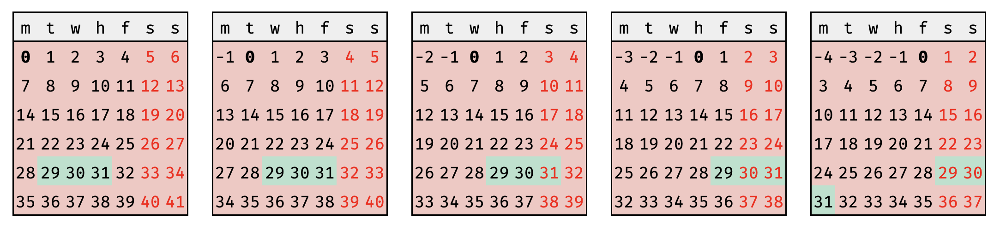

# don't let LLMs erode first principles thinking

2025-01-12

## background

consider a trader who is backtesting a series of alphas that target the 30 DTE contracts on the S&P 500 Index options chain. to increase sample size, the trader uses a window of +/- one day from the target.

the trader considers the following:

- $\textit{if presented with multiple equivalent contracts on a given trading day,}$ $\textit{how should the backtest and live trading code handle DTE selection?}$

in order to avoid adding complexity where unncessary, the trader starts question the premise:

- $\textit{under what circumstances does such a choice even exist?}$

## use an llm!

through the selectively biased lens of my day-to-day experiences, it seems increasingly more common to default to $\textit{machine-first}$ thinking instead of $\textit{human-first}$ thinking. stated another way, there seems to be an upward trend of $\textit{outsourcing logic and reasoning}$.

for clarity, $\textit{machine-first}$ thinking is **not** the same as $\textit{machine-aided}$ thinking. in my mental model, $\textit{machine-aided}$ thinking is a subset of $\textit{human-first}$ thinking:

- (h)uman-first | $\text{conjecture}^{\text{h}} \rightarrow \text{reasoning}^{\text{h}} \rightarrow \text{outcome}^{\text{h}}$
- (m)achine-first | $\text{conjecture}^{\text{h}} \rightarrow \text{reasoning}^{\textbf{m}} \rightarrow \text{outcome}^{\text{m}}$

of course, $\textit{machine-first}$ thinking is represented in a reductive manner above; to capture the notion that a human supervises the $\textbf{reasoning}$, let us expand the notation a bit:

- (m)achine-first | $\text{conjecture}^{\text{h}} \rightarrow \text{reasoning}^{C(1-\epsilon)\textbf{m}+\epsilon\text{h}} \rightarrow \text{outcome}^{\text{*}}$

the expression of ${C(1-\epsilon)\text{m}+\epsilon\text{h}}$ simply captures:

- if a human spends $\epsilon$ effort supervising, the machine spends $1-\epsilon$ effort reasoning with whatever catch-all constant $C$ satisfies the inequality between human-to-machine reasoning.

for example, one might say that someone who blindly accepts machine reasoning has $\epsilon=0$:

- $\text{conjecture}^{\text{h}} \rightarrow \text{reasoning}^{C\textbf{m}} \rightarrow \text{outcome}^{\text{m}}$

furthermore, by definition, $\textit{human-first}$ thinking blindly rejects machine reasoning i.e. $\epsilon=1$:

- $\text{conjecture}^{\text{h}} \rightarrow \text{reasoning}^{\textbf{h}} \rightarrow \text{outcome}^{\text{h}}$

while i am admittedly a staunch contrarian when it comes to the topic of LLMs, i do concede they have realized utility in some applications. my intention is not to debate the utility curve of LLMs; rather, i aim to invite deeper thinking about effects of human-LLM interactions.

$\textit{outsourcing logic and reasoning}$ may be perfectly valid in some contexts, but not all contexts. what i worry about most is that continuous exposure to $\textit{outsourcing logic and reasoning}$ in valid contexts erodes the human detection mechanism responsible for drawing that line in the first place.

as of writing, machines cannot reason from first-principles; therefore, humans must become more resilient in explicitly protecting the spaces in which $\textit{outsourcing logic and reasoning}$ may lead to less than ideal outcomes. a serendipitous, cherry-picked personal example follows for those interested in virtually useless proofs.

## virtually useless proof

if one were to take trading days $T$ and weekends $W$ as such:

$$T = \{0, 1, 2, 3, 4\}$$

$$W = \{5, 6\}$$

if today $t \in T$ and target DTE $D$, one might observe that deriving day of the week $d \in \{T\cup{W}\}$ for $D$ is simply:

$$(t + D)\mod{7} = d$$

for 30$\pm{1}$ DTE strategies, one is never presented two equivalent choices for days-to-expiry in non-holiday conditions.

using the above, one observes when the possibility of a choice may arise:

$$d \in W \iff t \in \{3 , 4 \}$$

that is to say, a choice may only happen on Thursday or Friday. given, two choices: $D_{-1}'$ and $D_{+1}'$ representing 29 DTE and 31 DTE, respectively:

$$(3 + D_{-1}')\mod{7} = 4$$

$$(3 + D_{+1}')\mod{7} = 6$$

$$(4 + D_{-1}')\mod{7} = 5$$

$$(4 + D_{+1}')\mod{7} = 0$$

thus, $t=3$ is always presented $D_{-1}'$ while $t=4$ is always presented $D_{+1}'$.

## visual proof

using $0$ to indicate the current trading day, there exists a nice visual proof; make note of when $t=3$ (thursday) is the current day $(0)$ and $t=4$ (friday) is the current day $(0)$.

## closing thoughts

questioning assumptions and re-stating base truths often can combat misguided efforts, such as adding complexity where none is required. this is the essense of $\textit{human-first}$ thinking that must continue to be protected in the age of $\textit{outsourcing logic and reasoning}$.

as always, it is helpful to take a step back every now and then and ask,

$\textit{why?}$

## appendix: llm responses

note: in no way are the results below meant to be cherrypicked, i do not pay for any LLM services. as such, the results below are derived using the "smartest" free model i could select.

additionally, there's usually more than one way to do the same thing; i am sure there exists a "$\textit{machine-first}$ power user" who could likely construct the proof above (or some similarly acceptable proxy of the proof) in a similar amount of time that i spent constructing it $\textit{human-first}$... perhaps even shorter?

**Prompt**

SPXW options have 5 daily expirations (Monday-Friday) I want to trade an options strategy that buys 30 DTE contracts, but I want to include +/-1 day in my range (29-31 DTE) to ensure I get enough samples when 30 DTE isn't available.

Give me a list by weekday (Monday-Friday) of which expiries (29, 30, 31 DTE) are available.

**ChatGPT Response**

Monday

- 29 DTE: Tuesday 4 weeks ahead
- 30 DTE: Monday 4 weeks ahead
- 31 DTE: Friday 5 weeks ahead

Tuesday

- 29 DTE: Wednesday 4 weeks ahead
- 30 DTE: Tuesday 4 weeks ahead
- 31 DTE: Monday 4 weeks ahead

Wednesday

- 29 DTE: Thursday 4 weeks ahead
- 30 DTE: Wednesday 4 weeks ahead
- 31 DTE: Tuesday 4 weeks ahead

Thursday

- 29 DTE: Friday 4 weeks ahead
- 30 DTE: Thursday 4 weeks ahead
- 31 DTE: Wednesday 4 weeks ahead

Friday

- 29 DTE: Monday 4 weeks ahead
- 30 DTE: Friday 4 weeks ahead
- 31 DTE: Thursday 4 weeks ahead

Notes:

- SPXW options expire daily, so you will always have an expiration available for 29, 30, or 31 DTE.
- Adjusting your strategy to include this 3-day range ensures sufficient samples regardless of your starting point in the week.

**Gemini Response (2.0 Flash)**

Here's a breakdown of the available SPXW expirations (29, 30, and 31 days to expiry) by weekday:

- Monday: 31 DTE, 30 DTE, 29 DTE
- Tuesday: 30 DTE, 29 DTE
- Wednesday: 29 DTE, 30 DTE
- Thursday: 30 DTE, 31 DTE
- Friday: 31 DTE, 30 DTE, 29 DTE
